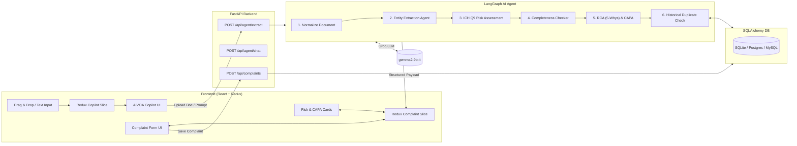

# AI-Powered Customer Complaint Management System
---

## 1. Executive Summary & Objective

Pharmaceutical manufacturing of Active Pharmaceutical Ingredients (API) and Finished Dosage Forms (FDF) is strictly governed by global cGMP regulations (**FDA 21 CFR Part 211 / Part 11**, **EU GMP Volume 4**, and **ICH Q9/Q10**). When a customer or hospital logs a defect, rapid intake, rigorous triage, root cause analysis, and risk-calibrated CAPA (Corrective and Preventive Action) are mandatory.

This system delivers an **AI-native Customer Complaint Management module** built around **LangGraph** and **Groq (`gemma2-9b-it` / `llama-3.3-70b-versatile`)** that autonomously:
1. Ingests raw complaint documents (PDF, DOCX, TXT, EML) or customer email prompts.
2. Executes a multi-node LangGraph agent to extract structured QMS entities.
3. Automatically populates the **Log Customer Complaint** form.
4. Performs an **ICH Q9 Quality Risk Assessment** (Patient Safety Impact, Defect Class, Health Hazard Evaluation).
5. Runs bonus AI quality tools:
   - **Complaint Completeness Checker** (% score & missing field audit).
   - **Root Cause Recommendation** (5-Whys chain & Ishikawa Fishbone analysis).
   - **CAPA Recommendation** (Immediate containment, Corrective, and Preventive actions).
   - **Historical Duplicate Detection** (Identifies recurring lot/batch defects across lines).
   - **Executive QMS Summary Generator** (Audit-ready synopsis for QA committee).

---

## 2. Mandatory Technology Stack Adherence

| Layer | Requirement | Implementation Details |
| :--- | :--- | :--- |
| **Frontend** | React UI with Redux | React 18 with Redux Toolkit (`@reduxjs/toolkit`, `react-redux`), Tailwind CSS, Lucide icons |
| **Backend** | Python with FastAPI | Python 3.13, FastAPI, Uvicorn, Pydantic v2 |
| **AI Framework**| LangGraph | Multi-node state graph (`StateGraph`) with sequential reasoning nodes |
| **LLMs** | Groq (`gemma2-9b-it`) | `langchain_groq` (`gemma2-9b-it` & `llama-3.3-70b-versatile`) + resilient deterministic fallback |
| **Database** | MySQL / Postgres / SQLite | SQLAlchemy 2.0 ORM with zero-config SQLite default + dynamic `DATABASE_URL` for PostgreSQL/MySQL |
| **Typography** | Google Inter | Inter Google font configured in `index.html` & `tailwind.config.js` |

---

## 3. End-to-End System Architecture



---

## 4. Quick Start & Setup Guide

### Prerequisites
- Python 3.10+ (tested on Python 3.13)
- Node.js v18+ (tested on Node v22)
- Git

### 1. Clone & Navigate
```bash
git clone <your-repo-url>
cd aivoa_complaint_system
```

### 2. Backend Setup
```bash
cd backend

# Activate virtual environment
python3 -m venv venv
source venv/bin/activate

# Install dependencies
pip install -r requirements.txt

# (Optional) Configure Groq API Key
cp .env.example .env
# Edit .env and set your GROQ_API_KEY if available.
# (If omitted, the app uses its built-in realistic QMS fallback engine)

# Start FastAPI server
uvicorn app.main:app --reload --port 8000
```
Backend will be live at `http://localhost:8000`.  
Swagger API documentation: `http://localhost:8000/docs`.

### 3. Frontend Setup
Open a new terminal:
```bash
cd frontend

# Install npm dependencies
npm install

# Start Vite dev server
npm run dev
```
Frontend will be live at `http://localhost:5173`.

---

## 5. Sample Realistic Pharma Data Provided

The `samples/` directory includes realistic pharmaceutical defect documents:
1. `samples/amoxicillin_capsule_discoloration.eml`: Hospital email regarding capsule discoloration and blister seal pinholes.
2. `samples/metformin_api_particulate_defect.txt`: Incoming raw material rejection for bulk API metallic particulate contamination.
3. `samples/atorvastatin_carton_label_mismatch.txt`: Distributor report of smudged batch lot codes on secondary folding cartons.
4. `samples/ciprofloxacin_sterile_vial_leak.pdf`: Official hospital PDF defect advisory regarding hairline vial cracks and sterility breach.

---
